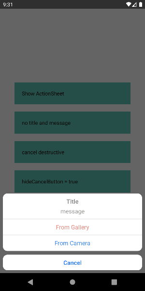
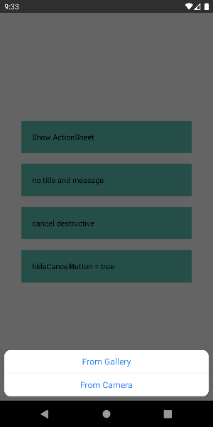
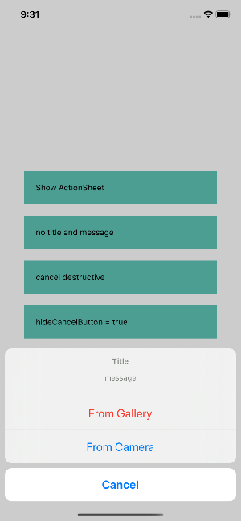
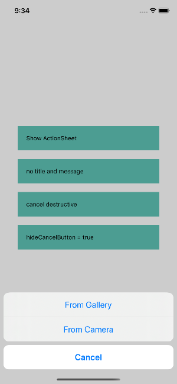

# React Native ActionSheet
Inspired by [talut/rn-actionsheet-module](https://github.com/talut/rn-actionsheet-module).

This package will help you to using ActionSheet cross platform iOS(ActionSheetIOS) and Android(BottomSheetDialog). 

Use the same way as [`ActionSheetIOS`](https://facebook.github.io/react-native/docs/actionsheetios), simply just change ActionSheetIOS to ActionSheet.

## Screenshots
<table>
  <tr>
    <td>
      Android
    </td>
    <td>
      iOS
    </td>
  </tr>
  <tr>
    <td>
       
      <br>
      
    </td>
    <td>
      
      <br>
      
    </td>
  </tr>
<table>

## Installation

``` bash
# with npm
npm install @powerdesigninc/react-native-actionsheet
# with yarn
yarn add @powerdesigninc/react-native-actionsheet
```

### React Native >= v0.60

you don't need to link anything. [Native Modules are now Autolinked](https://facebook.github.io/react-native/blog/2019/07/03/version-60#native-modules-are-now-autolinked)

### React Native < v0.60, Manual linking

```
react-native link @powerdesigninc/react-native-actionsheet
```

## Example

``` tsx
import ActionSheet from "@powerdesigninc/react-native-actionsheet"

const App = () => {
  return (
    <View style={styles.container}>
      <TouchableOpacity
        style={styles.button}
        onPress={() => {
          ActionSheet.showActionSheetWithOptions(
            {
              title: 'Title',
              message: 'message',
              options: ['Cancel', 'From Gallery', 'From Camera'],
              destructiveButtonIndex: 1,
              cancelButtonIndex: 0,
            },
            index => {
              switch (index) {
                case 1: 
                  Alert.alert('From Camera clicked');
                  break;
                case 2: 
                  Alert.alert('From Camera clicked');
                  break;
                case 0: 
                  Alert.alert('onCancel');
                  break;
                default: 
                  Alert.alert('Default');
                  break;
              }
            },
          );
        }}>
        <Text>Show ActionSheet</Text>
      </TouchableOpacity>
    </View>
  );
};
```

## Options
``` typescript
// same as ActionSheetIOSOptions
interface ActionSheetOptions {
  title?: string;
  options: string[];
  cancelButtonIndex?: number;
  destructiveButtonIndex?: number;
  message?: string;
  anchor?: number;
  tintColor?: string;
  hideCancelButton?: boolean; // if you don't want to show cancel on Android, but no effect on iOS
}
```

## Run Example Project
``` bash
cd example
yarn install

yarn ios
yarn android
```

## License
This project is licensed under the MIT License - see the [LICENSE.md](./LICENSE.md) file for details
