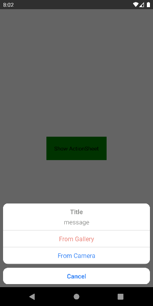
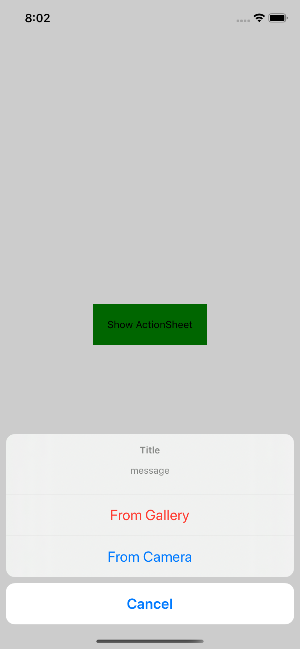

# React Native ActionSheet
Inspired by [talut/rn-actionsheet-module](https://github.com/talut/rn-actionsheet-module).

This package will help you to using ActionSheet cross platform iOS(ActionSheetIOS) and Android(BottomSheetDialog). 

Use the same way as [`ActionSheetIOS`](https://facebook.github.io/react-native/docs/actionsheetios), simply just change ActionSheetIOS to ActionSheet.

## Screenshots
<table>
  <tr>
    <td>
      Android
    </td>
    <td>
      iOS
    </td>
  </tr>
  <tr>
    <td>
      
    </td>
    <td>
      
    </td>
  </tr>
<table>

## Installation

``` bash
# with npm
npm install @powerdesigninc/react-native-actionsheet
# with yarn
yarn add @powerdesigninc/react-native-actionsheet
```

### React Native >= v0.60

you don't need to link anything. [Native Modules are now Autolinked](https://facebook.github.io/react-native/blog/2019/07/03/version-60#native-modules-are-now-autolinked)

### React Native < v0.60, Manual linking

```
react-native link @powerdesigninc/react-native-actionsheet
```

## Example

``` tsx
import ActionSheet from "@powerdesigninc/react-native-actionsheet"

<TouchableOpacity onPress={() => {
   ActionSheet.showActionSheetWithOptions(
       {
          title : "Title",
          message : "message",
          options : ["Cancel", "From Gallery", "From Camera"],
          cancelButtonIndex : 0, // default is 0
       }, (index) => {
        switch (index) {
         case 1: {
           alert("From Camera clicked")
         }
         case 2: {
           alert("From Camera clicked")
         }
         case 0: {
           alert("onCancel")
         }
         default:{
           alert("Default")
         }
        }
       }
   )
}}>
  <Text>Show ActionSheet</Text>
</TouchableOpacity>
```

## Options
``` typescript
// same as ActionSheetIOSOptions
interface ActionSheetOptions {
  title?: string;
  options: string[];
  cancelButtonIndex?: number;
  destructiveButtonIndex?: number;
  message?: string;
  anchor?: number;
  tintColor?: string;
}
```

## License
This project is licensed under the MIT License - see the [LICENSE.md](./LICENSE.md) file for details
